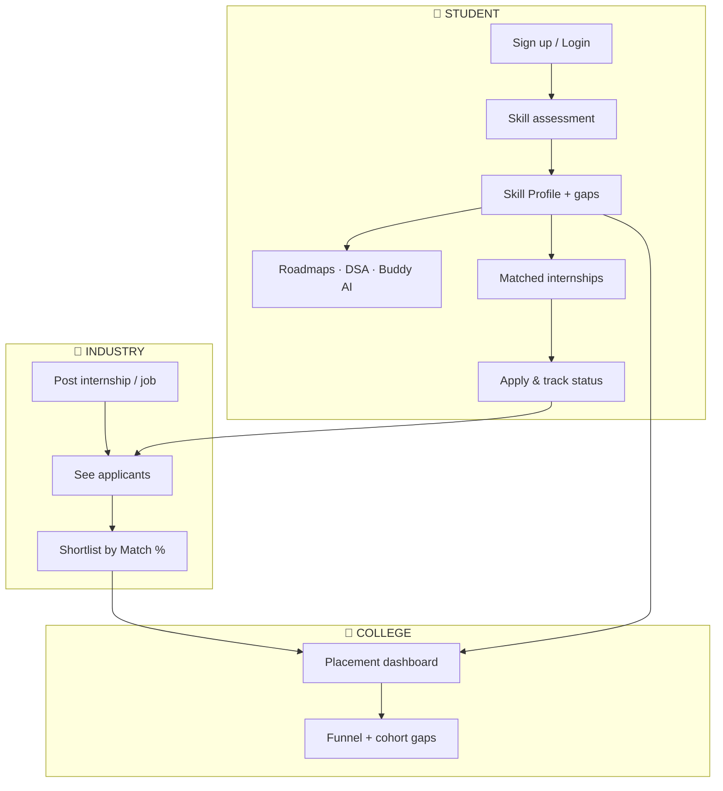
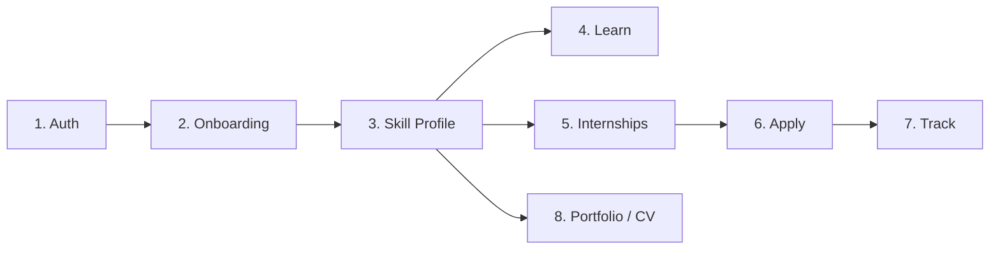
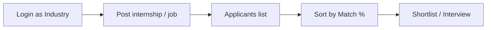
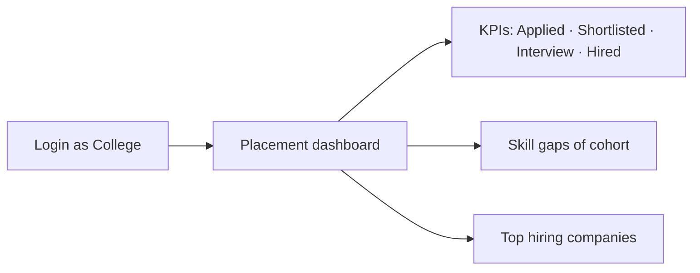
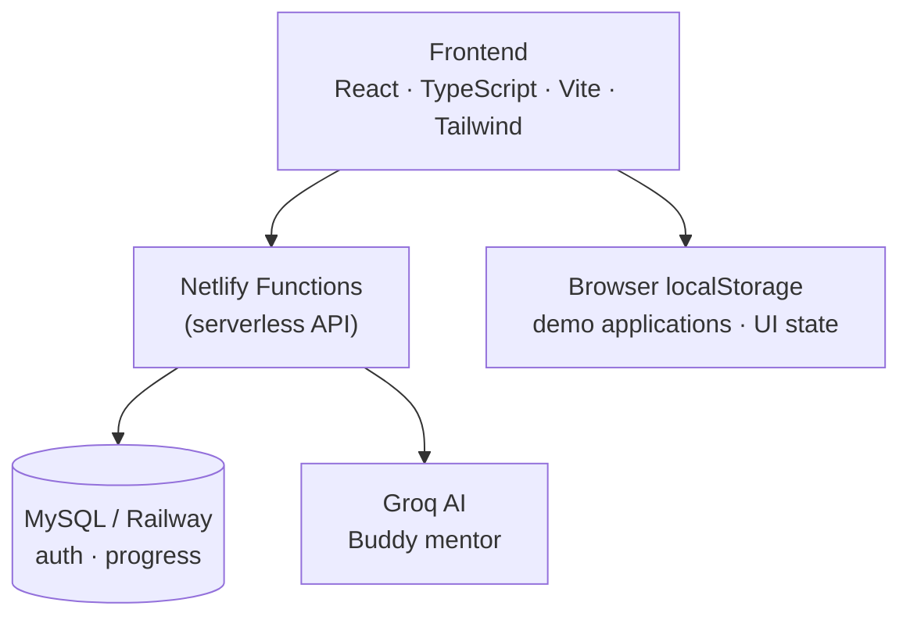

# EDUROUTE

### Academia–Industry Collaboration Portal  
**Skill Mapping · Internships · Placement**

---

| | |
|---|---|
| **Hackathon** | Smart India Hackathon 2026 |
| **Problem Statement** | **SIH26144** — Portal for Academia–Industry collaboration for Skill Mapping, Internships and Placement |
| **Category** | Software |
| **Theme** | Smart Education / Automation |
| **Live demo** | **https://eduroutee.netlify.app/** |

[](https://www.sih.gov.in/)
[](https://sih.gov.in/sih2026PS)
[](https://eduroutee.netlify.app/)

> **For jury / shortlisters:** Open the live demo → walk the 3 roles below → match each screen to SIH26144 in Section 5.

---

## Slide 1 — The problem (30 seconds)

Colleges teach skills. Industry needs different skills. Students get stuck in between.

```text
   COLLEGE                          INDUSTRY
   What is taught          ≠        What is hired
        │                                │
        └──────── STUDENT ───────────────┘
                   │
         Unclear gaps · Random applications
         Weak portfolio · No placement view
```

| Who | Pain today |
|-----|------------|
| **Student** | Doesn’t know skill gaps; applies randomly; portfolio is incomplete |
| **Industry** | Hard to find skill-matched candidates; too many noisy applications |
| **College** | Cannot see placement funnel or cohort skill gaps |

**EDUROUTE** connects all three on one portal: assess → map → match → apply → place.

---

## Slide 2 — Solution in one picture



**One sentence:** Students discover gaps and apply to matched roles; industry shortlists by fit; colleges see the full placement funnel.

---

## Slide 3 — How a student uses EDUROUTE (workflow)



| Step | What happens | Where in app |
|------|----------------|--------------|
| **1. Auth** | Email signup/login or **GitHub / LinkedIn** | `/signup` · `/login` |
| **2. Onboarding** | Interest track + yes/no gap quiz | `/onboarding` |
| **3. Skill Profile** | Scores · Good / Improve / Gap · next steps | Skill Profile |
| **4. Learn** | Roadmaps (YouTube + docs per topic) · DSA Sheet · Assessments · **Buddy AI** | Roadmaps · DSA · Assessments |
| **5. Internships** | Cards with **Match %** · “Recommended for you” | Internships |
| **6. Apply** | One-click apply to openings | Internship detail |
| **7. Track** | Applied → Shortlisted → Interview → Hired | Applications / Journey |
| **8. Showcase** | Digital portfolio + CV Builder | Portfolio · CV Builder |

**Bonus learning path:** Profile → **Living Learning Path** (nodes: completed / in-progress / locked) with progress % and detail panel.

---

## Slide 4 — Industry & College workflows

### Industry



- Workspace: `/industry`  
- Post roles with required skills  
- Review applicants ranked by **match score**

### College



- Workspace: `/college/placements`  
- Funnel chart · readiness score · open jobs/internships  
- One theme toggle + logout in the college header

---

## Slide 5 — Mapping to SIH26144 (jury checklist)

| SIH26144 requirement | EDUROUTE delivers |
|----------------------|-------------------|
| Skill assessment | Onboarding tracks + gap questions |
| Skill mapping | Skill Profile (Good / Improve / Gap) + recommendations |
| Internship & job opportunities | Student feed + industry postings |
| Matching students ↔ openings | **Match %** on cards · recommended list |
| Application & tracking | Apply → Shortlisted → Interview → Hired |
| Industry collaboration | Industry workspace to post & shortlist |
| Institution visibility | College placement dashboard |
| Learning support | Roadmaps, DSA, Assessments, **Buddy AI**, Living Path |
| Student portfolio | Portfolio + CV Builder |
| Faculty collaboration | Faculty opportunities + official portal links |

---

## Slide 6 — Feature map (product tree)

```text
EDUROUTE
│
├─ 👤 Student
│   ├─ Auth (email · GitHub · LinkedIn)
│   ├─ AI onboarding (track + gap quiz)
│   ├─ Skill Profile + Living Learning Path
│   ├─ Internships (Match % · apply pipeline)
│   ├─ Roadmaps (YouTube + Document per topic)
│   ├─ DSA Sheet · Assessments · Leaderboard · Rewards
│   ├─ Community (+ Discord)
│   ├─ CV Builder · Portfolio
│   └─ Buddy AI mentor (floating assistant)
│
├─ 👨‍🏫 Faculty
│   └─ Opportunities + official portal links
│
├─ 🏢 Industry
│   ├─ Post internship / job
│   └─ Applicants + shortlist by match
│
└─ 🏫 College
    └─ Placement funnel dashboard
```

---

## Slide 7 — Architecture (how it is built)



| Layer | Choice |
|-------|--------|
| UI | React 18 · TypeScript · Vite · Tailwind · Framer Motion · Lucide |
| Hosting | Netlify (static site + serverless functions) |
| Auth / data | MySQL (Railway) via Netlify functions |
| AI | Buddy chat powered by Groq (Llama) |
| Demo data | localStorage for applications, path UI, placement seed |

---

## Slide 8 — Why this works for SIH (impact)

| Jury lens | EDUROUTE response |
|-----------|-------------------|
| **Problem clarity** | Directly targets academia–industry skill gap |
| **Completeness** | Student + Industry + College in **one** product |
| **Working demo** | Live site · apply → shortlist → placement path |
| **Innovation** | Gap onboarding · match scoring · AI mentor · living path UI |
| **Feasibility** | Standard web stack · deployed on Netlify |
| **Impact** | Better employability · cleaner hiring · college visibility |

---

## Slide 9 — Demo script (5 minutes)

Use **https://eduroutee.netlify.app/**

| Time | Action | What to show |
|------|--------|--------------|
| 0:00 | Open live site | Landing · nav · theme toggle |
| 0:30 | Student login / signup | Auth (optional GitHub / LinkedIn) |
| 1:00 | Onboarding | Track + gap quiz → Skill Profile |
| 1:45 | Roadmaps | Open any course → YouTube + Document per topic |
| 2:15 | Internships | Match % cards → Apply |
| 2:45 | Profile path | Living Learning Path nodes + panel |
| 3:15 | Buddy AI | Floating “How can I help you?” → ask |
| 3:45 | Industry (if demo account) | Post role · applicants |
| 4:15 | College (if demo account) | Placement funnel · skill gaps |
| 4:45 | Close | One portal · three stakeholders |

---

## Slide 10 — Future scope

- NSQF / NOS competency taxonomy  
- Faculty FDP modules  
- Server-synced applications for all roles  
- Verifiable digital credentials on portfolio  
- Adaptive assessments tied to learning-path nodes  

---

## Quick start (developers)

```bash
git clone https://github.com/laxmikhandelwal690-svg/eduroute_.git
cd eduroute_
npm install
npm run dev
```

Optional env (cloud auth / Buddy): `MYSQL_URL` · `JWT_SECRET` · `GROQ_API_KEY` · GitHub/LinkedIn OAuth secrets.

---

**EDUROUTE — Learn · Map skills · Match · Get hired**

**Live demo:** https://eduroutee.netlify.app/
