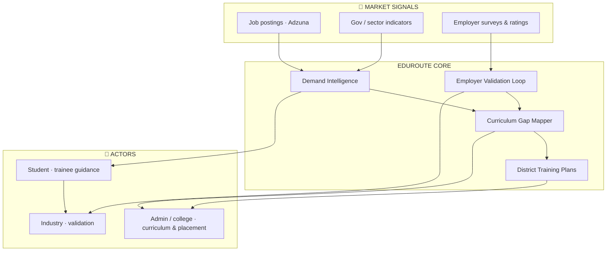

# EDUROUTE

### Labour-Market Intelligence & Curriculum Alignment Platform  
**Demand signals · Skill gaps · Employer validation · District training plans**

---

| | |
|---|---|
| **Hackathon** | Smart India Hackathon 2026 |
| **Problem Statement** | **SIH26134** — Challenges in aligning skill development programs with industry requirements and emerging job market demands |
| **Organization** | Government of Maharashtra |
| **Department** | Maharashtra State Innovation Society, Department of Skills, Employment, Entrepreneurship and Innovation |
| **Category** | Software |
| **Theme** | Miscellaneous |
| **Live demo** | **https://eduroutee.netlify.app/** |

[](https://www.sih.gov.in/)
[](https://sih2026.vuce.in/ps/SIH26134)
[](https://eduroutee.netlify.app/)

> **For jury / shortlisters:** Open the live demo → Demand Intel · Curriculum Gaps · Employer Validation · Student path → map each screen to SIH26134 outcomes below.

---

## 1 — The problem (SIH26134)

Skill-development programmes are often designed around **broad or historical occupation categories** that lag changing technologies, **local industry demand**, job roles, productivity standards and employer expectations.

| Stakeholder | Pain today |
|-------------|------------|
| **Trainees / students** | Finish courses with weak placement potential; unclear which skills the market actually needs |
| **Employers** | Struggle to find job-ready candidates; limited feedback loop into curriculum |
| **Training providers / colleges** | Curricula, equipment and assessments lag demand; hard to know what to **add / remove / update** |
| **District planners** | No continuous, evidence-based view of demand by role, skill, location and proficiency |

**EDUROUTE** is a continuous, evidence-based platform that turns **live job-market signals + employer validation** into curriculum decisions, capacity planning and candidate guidance.

---

## 2 — Expected solution (mapped to the product)

Per SIH26134, the platform should combine job-posting signals, employer surveys, sector trends and placement context to:

| Required capability | EDUROUTE feature |
|---------------------|------------------|
| Labour-market intelligence from job signals | **Demand Intelligence** — live Adzuna + curated signals, filters, KPIs, skills & role trends, district heatmap |
| Demand by role, skill, location, proficiency | Demand Intel filters + trend analyse; skill gap bars vs market |
| Map gaps to courses / qualifications | **Curriculum ↔ Skill Gap Mapper** (admin) — taught % vs demand %; flags |
| Recommend curriculum updates | Gap mapper: **add / remove / update** module recommendations |
| Flag obsolete or oversupplied courses | Flags: `obsolete` · `oversupplied` · `critical_gap` · `healthy` |
| Employer validation | **Industry → Employer validation** — ratings, must-have vs nice-to-have skills, approve/reject curriculum suggestions, surveys |
| District-level training plans | **District Training Plan** (admin) — capacity-oriented planning view |
| Candidate guidance | Student **Skill Profile**, **Living Learning Path**, matched internships, AI Course Designer, Buddy AI |

---

## 3 — Solution architecture (one picture)


```mermaid
flowchart TB
  subgraph SIGNALS["📡 MARKET SIGNALS"]
    J[Job postings · Adzuna]
    G[Gov / sector indicators]
    E[Employer surveys & ratings]
  end

  subgraph CORE["EDUROUTE CORE"]
    DI[Demand Intelligence]
    CG[Curriculum Gap Mapper]
    EV[Employer Validation Loop]
    TP[District Training Plans]
  end

  subgraph ACTORS["👥 ACTORS"]
    ST[Student · trainee guidance]
    IN[Industry · validation]
    AD[Admin / college · curriculum & placement]
  end

  J --> DI
  G --> DI
  E --> EV
  DI --> CG
  EV --> CG
  CG --> TP
  DI --> ST
  CG --> AD
  EV --> IN
  TP --> AD
  ST --> IN
```

**One sentence:** Live demand and employer feedback drive curriculum decisions and trainee guidance on one portal.

---

## 4 — Role workflows

### Student / trainee
1. Auth → onboarding (track + skill gap quiz)  
2. **Skill Profile** — strengths, gaps, match vs live demand  
3. **Demand Intel** — see rising roles & skills in their region  
4. **Learning path / roadmaps / AI Course Designer** — close gaps  
5. Matched **internships** → apply & track · portfolio & certificates  

### Industry
1. Post roles / internships  
2. Review applicants with match context  
3. **Employer validation** — rate course job-readiness, list must-have skills, approve or reject curriculum suggestions  

### Admin / college / planner
1. **Curriculum Gaps** — taught vs demand; obsolete / oversupplied / critical  
2. **District Training Plan** — planning outputs for capacity & modules  
3. Placement / cohort visibility where available  

---

## 5 — Feature map (demo routes)

| Area | Route / entry | What jury sees |
|------|----------------|----------------|
| Demand Intelligence | Career → **Demand Intel** (`/demand-intelligence`) | Job signals, filters, KPIs, skills, role trends, district heatmap, employer validation feed |
| Trend analyse | Intelligence → Trend Analyse | Student vs live market skill gap analysis (Groq/Gemini when keyed) |
| Curriculum gaps | Admin → **Curriculum Gaps** | Course ↔ industry demand matrix; add/remove/update recommendations; status flags |
| District plans | Admin → District Training Plan | District-oriented training plan data |
| Employer validation | Industry → **Employer validation** | Ratings, skill lists, surveys, curriculum decision loop |
| Skill assessment & profile | Onboarding · Skill Profile · Profile | Gaps, XP, railway learning path, heatmap |
| Learn & close gaps | Roadmaps · AI Course Designer · Buddy AI · Assessments | Paths, designed courses, mentor chat, quizzes |
| Match & place | Internships · Certifications · Portfolio · Events | Apply, certs, digital portfolio, live events |

---

## 6 — Tech stack

```text
React 18 + TypeScript + Vite + Tailwind + Framer Motion
        │
        ▼
Netlify (static site + serverless functions)
        │
        ├── MySQL / Railway   (auth · progress where configured)
        ├── Adzuna API        (live job / event signals)
        ├── Groq / Gemini     (Buddy · trend summarise · course AI)
        └── localStorage      (demo applications · path UI · seeds)
```

| Layer | Choice |
|-------|--------|
| UI | React 18 · TypeScript · Vite · Tailwind · Framer Motion · Lucide · Recharts |
| Hosting | Netlify (pages + functions) |
| Auth / data | MySQL (Railway) via Netlify functions · JWT |
| Live demand | Adzuna · optional data.gov / curated gov hubs |
| AI | Groq (Llama) and/or Gemini for Buddy, trend notes, course design |
| Demo state | localStorage for applications, learning path, placement seeds |

---

## 7 — Why this fits SIH26134

| Jury lens | EDUROUTE response |
|-----------|-------------------|
| **Problem clarity** | Directly targets curriculum lag vs industry demand (Maharashtra skills dept PS) |
| **Evidence-based loop** | Job signals + employer validation → gap flags → curriculum recommendations |
| **Completeness** | Student guidance + industry validation + admin curriculum / district views |
| **Working demo** | Live Netlify deploy · Demand Intel · Curriculum Gaps · Employer Validation |
| **Feasibility** | Standard web stack · serverless APIs · optional AI keys |
| **Impact** | Stronger placement alignment · less obsolete training · clearer district planning |

---

## 8 — Demo script (≈ 5 minutes)

Use **https://eduroutee.netlify.app/**

| Time | Action | What to show |
|------|--------|--------------|
| 0:00 | Open live site | Landing · roles · theme |
| 0:30 | Student login / signup | Auth |
| 1:00 | Onboarding → Skill Profile | Gaps vs market |
| 1:30 | **Demand Intel** | Live signals · filters · district heatmap |
| 2:15 | **Curriculum Gaps** (admin) | Taught vs demand · obsolete / critical flags · recommendations |
| 3:00 | **Employer validation** (industry) | Rate course · must-have skills · approve suggestion |
| 3:45 | Learning path / internships | Close gaps · apply with match context |
| 4:30 | Close | Continuous demand → curriculum → trainee guidance |

---

## 9 — Future scope

- Deeper NSQF / NOS competency mapping  
- Longitudinal placement & wage outcome tracking  
- Expanded district capacity (equipment · trainer) plans  
- Stronger multi-source LMI (more states / sectors)  
- Verifiable credentials on portfolio  

---

## Quick start (developers)

```bash
git clone https://github.com/Vanshkhandelwal28/eduroute.git
cd eduroute
npm install
npm run dev
```

Optional env (Netlify / local):

- `MYSQL_URL` · `JWT_SECRET`
- `ADZUNA_APP_ID` · `ADZUNA_APP_KEY`
- `GROQ_API_KEY` and/or `GEMINI_API_KEY`
- Optional: `DATA_GOV_API_KEY` · GitHub/LinkedIn OAuth secrets

---

**EDUROUTE — Sense demand · Align curriculum · Guide talent · Get hired**

**Problem statement:** [SIH26134](https://sih2026.vuce.in/ps/SIH26134)  
**Live demo:** https://eduroutee.netlify.app/
